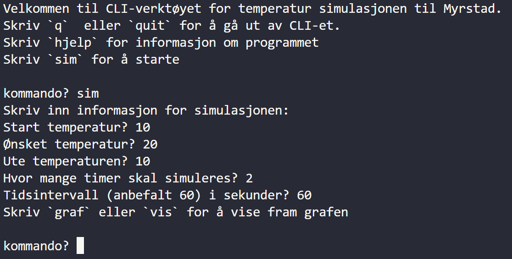
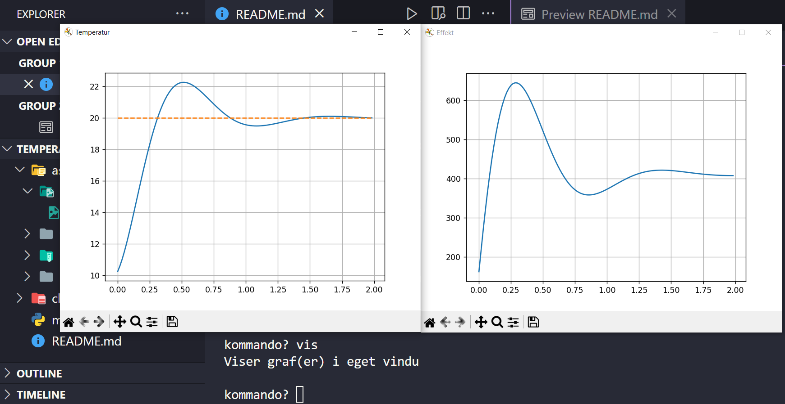

# Temperatursimulasjon av rom med varmetap og varmeovn (IT2 prosjekt)

prosjektet handler om å simulere et system med varmetap og et varmeelement som prøver å regulere

## Hvordan kjøre koden

Last ned hele prosjektet,

Kjør `main.py` og følg instruksene

## Brukermanual, hvordan bruke programmet

- hjelp: gir deg informasjon om hvordan å bruke programmet
- simuler: kjører en simulasjon
- graf: viser graf(ene)
- skjul: fjerner vindu(ene) med graf(er)
- klarer: fjerner informasjon fra graf(ene), så du kan begynne på nye grafer
- instillinger: (ikke implementert men, ønsket) endrer på variabler til systemets varmeelement/rom/regulator.
- avlutt: stopper programmet

## Struktur

`assets/single_file.py` samler alt i en [fil](./assets/single_file.py)

Ellers er alle klassene splittet opp, og stukturert innenfor `classes`, med et eget modul for `system`

## Bilder

### Brukergrensesnittet:

### Graf eksempel:

